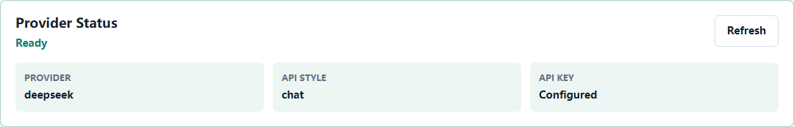
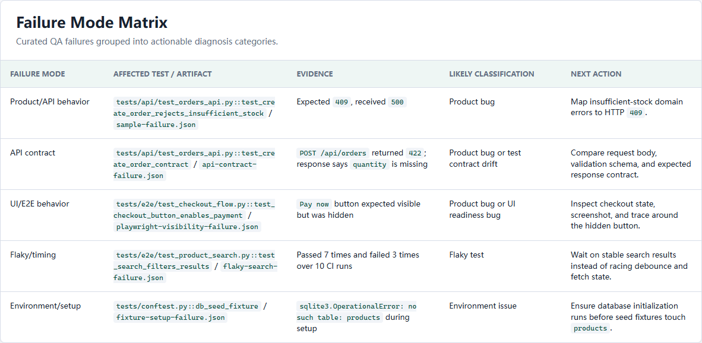

# AI QA Copilot

AI QA Copilot is a Python portfolio project that combines automated testing and AI-assisted failure diagnosis.

中文简介：这是一个面向求职展示的 AI 自动化测试平台。它用 Python 完成接口测试、浏览器 E2E 测试、CI 报告和 AI 失败诊断，适合展示从自动化测试向 AI 应用开发迁移的能力。

## What It Demonstrates

- FastAPI demo application used as the system under test
- API test automation with pytest
- Browser E2E automation with Playwright for Python
- Test reports, failure JSON artifacts, screenshots, and traces
- GitHub Actions CI
- Optional AI-generated diagnosis reports for failed tests

## Portfolio Walkthrough

For a 3-minute interview path, start with the Provider Status UI, run the bundled diagnosis examples, and show the Failure Mode Matrix in the sample report.

See [Portfolio Walkthrough](docs/portfolio-walkthrough.md) for the step-by-step demo script.

## Visual Preview





## Architecture

```text
FastAPI demo shop
  -> pytest API tests
  -> Playwright E2E tests
  -> failure artifacts
  -> AI diagnosis report
  -> GitHub Actions artifacts
```

See [docs/architecture.md](docs/architecture.md) for the full architecture and failure diagnosis flow.

See [docs/api-reference.md](docs/api-reference.md) for API endpoints and example payloads.

## Screenshots


## Local Setup

```powershell
python -m venv .venv
.\.venv\Scripts\Activate.ps1
python -m pip install --upgrade pip
python -m pip install -e ".[dev]"
python -m playwright install chromium
```

## Run The Demo App

```powershell
uvicorn app.main:app --reload
```

Open:

```text
http://127.0.0.1:8000
```

Demo account:

```text
username: alice
password: password123
```

## Run Tests

```powershell
pytest -q --browser chromium --tracing retain-on-failure --screenshot only-on-failure
```

## Run Full Local Verification

```powershell
powershell -ExecutionPolicy Bypass -File scripts/verify.ps1
```

## Generate AI Diagnosis

Without `OPENAI_API_KEY`, the command writes a fallback report:

```powershell
python -m qa_copilot.cli --input reports/latest/failures --output reports/latest/ai-diagnosis.md
```

With an API key:

```powershell
$env:OPENAI_API_KEY="your-api-key"
python -m qa_copilot.cli --input reports/latest/failures --output reports/latest/ai-diagnosis.md
```

With DeepSeek:

```powershell
$env:AI_PROVIDER="deepseek"
$env:DEEPSEEK_API_KEY="your-deepseek-key"
python -m qa_copilot.cli --input reports/examples --output reports/latest/demo-ai-diagnosis.md
```

## Demo Failure Flow

To generate a diagnosis report from the bundled sample failure artifact:

```powershell
python -m qa_copilot.cli --input reports/examples --output reports/latest/demo-ai-diagnosis.md
```

Generate a dry-run PR comment preview from a diagnosis report:

```powershell
python -m qa_copilot.pr_comment --input reports/examples/sample-ai-diagnosis.md --output reports/latest/demo-pr-comment.md
```

CI also generates a dry-run PR comment preview at:

```text
reports/latest/pr-comment.md
```

It is uploaded inside the `qa-reports` artifact. It does not call the GitHub API or post a real PR comment.

See [docs/demo-flow.md](docs/demo-flow.md) for the full demo flow.

See [docs/diagnosis-examples.md](docs/diagnosis-examples.md) for the curated Playwright, API, flaky-test, and fixture/setup failure examples.

## CI Artifacts

GitHub Actions uploads a `qa-reports` artifact for each CI run. It includes the pytest HTML report, structured failure JSON, AI diagnosis report, and dry-run PR comment preview.

For portfolio demos, the `Demo Artifacts` workflow can be started manually with `workflow_dispatch`. It builds a curated `demo-qa-reports` artifact from `reports/examples`, does not call the GitHub API, and does not post a real PR comment.

See [CI Artifacts](docs/ci-artifacts.md) for the file-by-file guide.

## AI API Adapter

The AI call is isolated behind a provider layer, so it can use OpenAI, DeepSeek, Qwen/DashScope, Kimi/Moonshot, SiliconFlow, OpenRouter, Doubao, or any OpenAI-compatible gateway through environment variables.

See [docs/api-adapters.md](docs/api-adapters.md) for configuration details.

List supported providers:

```powershell
python -m qa_copilot.cli --list-providers
```

Check the current provider configuration:

```powershell
python -m qa_copilot.cli --check-provider
```

Use `--fail-on-error` when a script should exit non-zero for an unhealthy provider configuration:

```powershell
python -m qa_copilot.cli --check-provider --fail-on-error
```

## Diagnosis API Endpoint

The demo app also exposes an API endpoint for generating a diagnosis from failure context:

```powershell
Invoke-RestMethod -Method Post -Uri http://127.0.0.1:8000/api/diagnosis -ContentType "application/json" -Body '{
  "nodeid": "tests/api/test_orders_api.py::test_create_order",
  "failed_at": "2026-07-02T10:00:00+00:00",
  "phase": "call",
  "duration_seconds": 0.12,
  "longrepr": "AssertionError: expected 409 but got 500",
  "keywords": ["api", "orders"]
}'
```

Supported provider metadata is available at:

```text
GET /api/ai-providers
```

Current provider configuration health is available at:

```text
GET /api/provider-health
```

This endpoint returns a redacted health summary. It does not expose API keys, key environment variable names, models, or custom base URLs.

## Example Artifacts

- `reports/examples/sample-failure.json`
- `reports/examples/playwright-visibility-failure.json`
- `reports/examples/api-contract-failure.json`
- `reports/examples/flaky-search-failure.json`
- `reports/examples/fixture-setup-failure.json`
- `reports/examples/sample-ai-diagnosis.md`
- `reports/examples/sample-pr-comment.md`

## Publish To GitHub

See [docs/github-publish.md](docs/github-publish.md) for the GitHub publishing checklist.

## 中文面试材料 / Chinese Interview Prep

中文材料覆盖项目一句话介绍、简历写法、Provider 安全设计、Failure Mode Matrix 讲解和常见面试问答。

See [docs/resume-zh.md](docs/resume-zh.md) for a Chinese resume description and interview talking points.

See [docs/interview-qa.md](docs/interview-qa.md) for interview questions and suggested answers.

See [docs/interview-walkthrough-zh.md](docs/interview-walkthrough-zh.md) for a 3-minute Chinese interview walkthrough.

## Resume Description

Built an AI-powered QA automation platform using Python, FastAPI, pytest, Playwright, and GitHub Actions. The system runs API and E2E tests, collects failure artifacts, and generates structured bug diagnosis reports with suspected root causes, reproduction steps, evidence, and fix suggestions.

## Interview Talking Points

- Why the project uses a real demo application instead of only test scripts
- How pytest fixtures isolate test data
- How Playwright traces and screenshots help debug UI failures
- How CI uploads reports for review
- How the AI module is optional and does not break normal test execution
