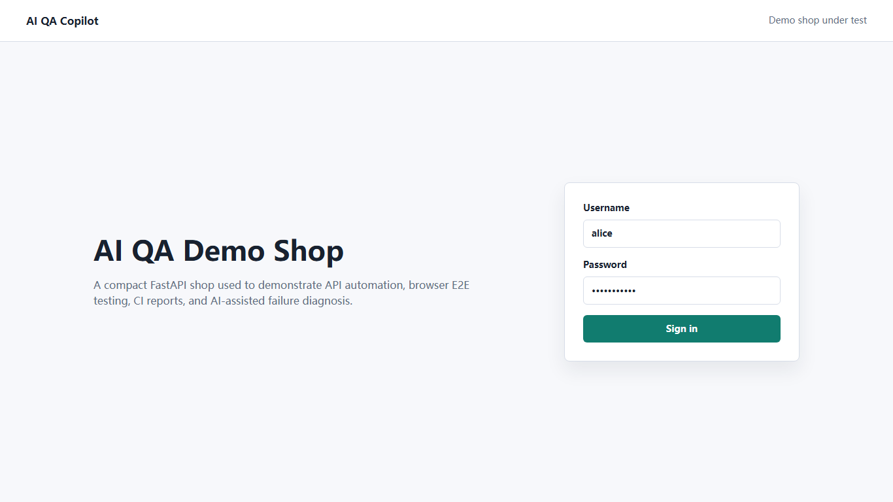
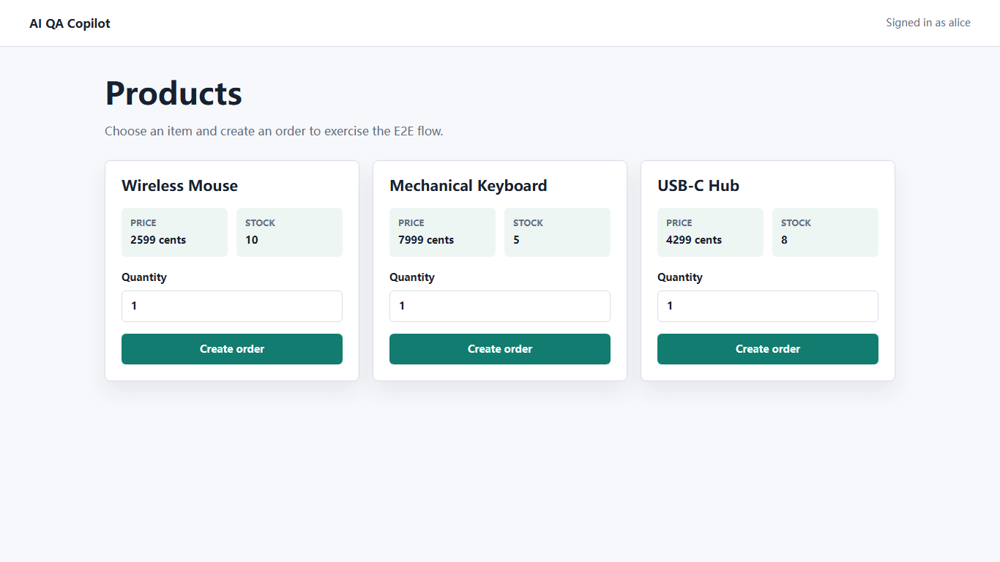

# AI QA Copilot

AI QA Copilot is a Python portfolio project that combines automated testing and AI-assisted failure diagnosis.

中文简介：这是一个面向求职展示的 AI 自动化测试平台。它用 Python 完成接口测试、浏览器 E2E 测试、CI 报告和 AI 失败诊断，适合展示从自动化测试向 AI 应用开发迁移的能力。

## What It Demonstrates

- FastAPI demo application used as the system under test
- API test automation with pytest
- Browser E2E automation with Playwright for Python
- Test reports, failure JSON artifacts, screenshots, and traces
- GitHub Actions CI
- Optional AI-generated diagnosis reports for failed tests

## Architecture

```text
FastAPI demo shop
  -> pytest API tests
  -> Playwright E2E tests
  -> failure artifacts
  -> AI diagnosis report
  -> GitHub Actions artifacts
```

See [docs/architecture.md](docs/architecture.md) for the full architecture and failure diagnosis flow.

See [docs/api-reference.md](docs/api-reference.md) for API endpoints and example payloads.

## Screenshots





## Local Setup

```powershell
python -m venv .venv
.\.venv\Scripts\Activate.ps1
python -m pip install --upgrade pip
python -m pip install -e ".[dev]"
python -m playwright install chromium
```

## Run The Demo App

```powershell
uvicorn app.main:app --reload
```

Open:

```text
http://127.0.0.1:8000
```

Demo account:

```text
username: alice
password: password123
```

## Run Tests

```powershell
pytest -q --browser chromium --tracing retain-on-failure --screenshot only-on-failure
```

## Run Full Local Verification

```powershell
powershell -ExecutionPolicy Bypass -File scripts/verify.ps1
```

## Generate AI Diagnosis

Without `OPENAI_API_KEY`, the command writes a fallback report:

```powershell
python -m qa_copilot.cli --input reports/latest/failures --output reports/latest/ai-diagnosis.md
```

With an API key:

```powershell
$env:OPENAI_API_KEY="your-api-key"
python -m qa_copilot.cli --input reports/latest/failures --output reports/latest/ai-diagnosis.md
```

## Demo Failure Flow

To generate a diagnosis report from the bundled sample failure artifact:

```powershell
python -m qa_copilot.cli --input reports/examples --output reports/latest/demo-ai-diagnosis.md
```

See [docs/demo-flow.md](docs/demo-flow.md) for the full demo flow.

## AI API Adapter

The AI call is isolated behind a provider layer, so it can use OpenAI directly or an OpenAI-compatible gateway through environment variables.

See [docs/api-adapters.md](docs/api-adapters.md) for configuration details.

## Diagnosis API Endpoint

The demo app also exposes an API endpoint for generating a diagnosis from failure context:

```powershell
Invoke-RestMethod -Method Post -Uri http://127.0.0.1:8000/api/diagnosis -ContentType "application/json" -Body '{
  "nodeid": "tests/api/test_orders_api.py::test_create_order",
  "failed_at": "2026-07-02T10:00:00+00:00",
  "phase": "call",
  "duration_seconds": 0.12,
  "longrepr": "AssertionError: expected 409 but got 500",
  "keywords": ["api", "orders"]
}'
```

## Example Artifacts

- `reports/examples/sample-failure.json`
- `reports/examples/sample-ai-diagnosis.md`

## Publish To GitHub

See [docs/github-publish.md](docs/github-publish.md) for the GitHub publishing checklist.

## For Chinese Interviews

See [docs/resume-zh.md](docs/resume-zh.md) for a Chinese resume description and interview talking points.

See [docs/interview-qa.md](docs/interview-qa.md) for interview questions and suggested answers.

## Resume Description

Built an AI-powered QA automation platform using Python, FastAPI, pytest, Playwright, and GitHub Actions. The system runs API and E2E tests, collects failure artifacts, and generates structured bug diagnosis reports with suspected root causes, reproduction steps, evidence, and fix suggestions.

## Interview Talking Points

- Why the project uses a real demo application instead of only test scripts
- How pytest fixtures isolate test data
- How Playwright traces and screenshots help debug UI failures
- How CI uploads reports for review
- How the AI module is optional and does not break normal test execution
