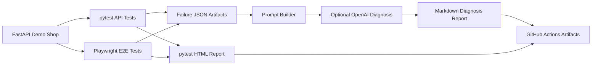

# Architecture

AI QA Copilot is organized around one practical QA workflow: run automated tests, collect failure evidence, and turn that evidence into a structured diagnosis report.

## Components

- `app/` contains the FastAPI demo shop used as the system under test.
- `tests/unit/` verifies business logic and QA Copilot utilities.
- `tests/api/` verifies HTTP behavior through FastAPI's test client.
- `tests/e2e/` verifies browser workflows through Playwright.
- `qa_copilot/` loads failure artifacts, builds AI prompts, calls OpenAI when configured, and writes Markdown reports.
- `qa_copilot/providers.py` adapts external AI APIs behind a small provider protocol.
- `reports/examples/` contains sample artifacts for recruiters and interviewers to inspect without running the project.

## Failure Diagnosis Flow

1. pytest runs unit, API, and browser tests.
2. A pytest hook writes failed test context into `reports/latest/failures/*.json`.
3. `python -m qa_copilot.cli` loads those JSON files.
4. The prompt builder converts failure context into a structured AI prompt.
5. If `OPENAI_API_KEY` is configured, the AI module asks the configured provider for a diagnosis.
6. If no key is configured or the AI call fails, the CLI writes a fallback report instead of breaking CI.
7. GitHub Actions uploads all reports as build artifacts.
